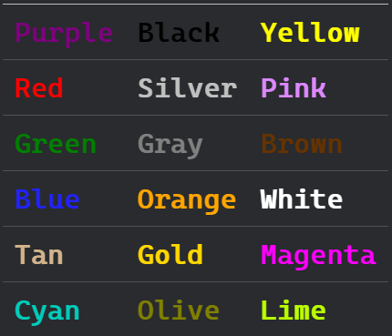

Book 2
===

**Tag Icon**

- Game || Train 🧶
- Target 🚩
- Advancement 🚀

## Unit 1 ~ 2

### 🧶Play the `happy & sad game`

用两个纸片画笑脸和哭脸，熟悉`I'm happy`和`I'm sad`语句。

### 🧶Words about `characters`

背出人物及其名字，以及对应的动物名。

- **`Mel`** is a `bird`. 🦉 She is a `girl`.
- **`Zap`** is a `unicorn`, not `horse`. 🦄 She is a `girl`.
- **`Roddy`** is a `kid`. 👦 He is a `boy`.
- **`Ben`** is a `bear`. 🐻 He is a `boy`.
- **`Kev`** is a `frog`. 🐸 He is a `boy`.
- **`Vic`** is a `hedgehog`. 🦔 She is a `girl`.

### 🧶Dialog about `characters`

!> What's your name? _/ Who are you?_

?> I'm **Neplor**.

!> Who is she?

?> She is **Zap**.

### 🧶Words about `met`

- `Hello`
- `Goodbye`

### 🧶Play the `met game`

互扔球的方式询问对方名字，练习`What's your name?`和`I'm <name>`的句式。

### 🧶Play the `how are you game`

练习问候语，并根据随机回答做出表情。

?> 🙄How to answer?

<!-- tabs:start -->

#### ** 感觉很High **

I'm `happy`. 😁

#### ** 感觉想死 **

I'm `sad`. 😂

#### ** 即没有很High也还不想死 **

I'm `fine`. 😎

<!-- tabs:end -->

### 🧶Alphabet Train

_熟悉26个英文字母_

🚩**熟悉26个英文字母的拼读**

### 🧶Dialog about `phonics`

!> What is it? 🅰

?> It's `A`.

!> What does 'A' say? _/What's the sound?_

?> 'A' says `/æ/`.

!> What's the sound? 🅱

?> `/b/`.

### 👓Alphablocks

**推荐观看《Alphablocks》节目学习自然拼读和单词。**

- [Season 1](https://www.bilibili.com/video/av21345291)
- [Season 2](https://www.bilibili.com/video/av21799282)
- [Season 3](https://www.bilibili.com/video/av27920570)
- [Season 4](https://www.bilibili.com/video/av27921037)

### 🧶Dialog about `animals`

!> What is it? 🦓

?> It's a `Zebra`.

!> What is it? 🐙

?> It's a `Octopus`.

### 🧶Dialog about `colours`

!> What colour is it? 🩲 _/ What's the color (of the item)?_

?> It's blue.

🧶**There's more colours here!** 🌈

### 🚀The pit of number

Here is your numbers `1 to 50000`.

### 🧶Words about `body`

|||||
|---|---|---|---|
|`arms`|`ears`|`eyes`|`chest`|
|`face`|`hair`|`head`|`belly`|
|`legs`|`mouth`|`nose`|`fingers`|
|`feet`(`foot`)||`teeth`(`tooth`)||

### 🧶Dialog about `numbers`

!> How many are there? 🧁🧁🧁 _/ How many cakes are there on the table?_

?> There are three (cakes). _/ There are three cakes on the table._

!> How many ears does Roddy have? 👂

?> Two ears.

!> How many noses does Roddy have?

?> Roddy has one nose. 👃 _/ He/It has ..._

### 🧶Play the `painting game`

一起画小怪兽吧！

## Unit 3

### 🧶Words about `toys`

- It's a `ball`(`football`). ⚽
- It's a `car`. 🚗
- It's a `doll`. 🎎
- Let's play `game`. 🎮
- It's a `puzzle`. 🧩
- It's a `robot`. 🤖
- It's a `teddy bear`. 🧸

### 🧶Dialog about `toy`

!> What is it? 🚗

?> It's a car.

!> What colour is it?

?> It's red.

!> Do you like it?

?> Yes, I do.

!> Do you have a blue car?

?> No, I don't.

!> How many buses are there on the sofa?  🏐🏐🏐

?> There are three. _/ There are three buses on the sofa._

## Unit 4

### 🧶Words about `stationeries`

- It's my `crayon`. 🖍
- It's my `eraser`.
- It's my `glue`. 🧴
- It's my `paper`. 📃
- It's my `pen`. 🖊
- It's my `pencil`. ✏
- It's my `pencil case`.
- It's my `ruler`. 📏
- It's my `scissors`. ✂

### 🧶Dialog about `stationeries`

!> What do you have? 📏

?> I have a ruler.

!> Do you have a pencil? ✏

?> No, I don't.

!> Do you have a crayon? 🖍

?> Yes, I do.
